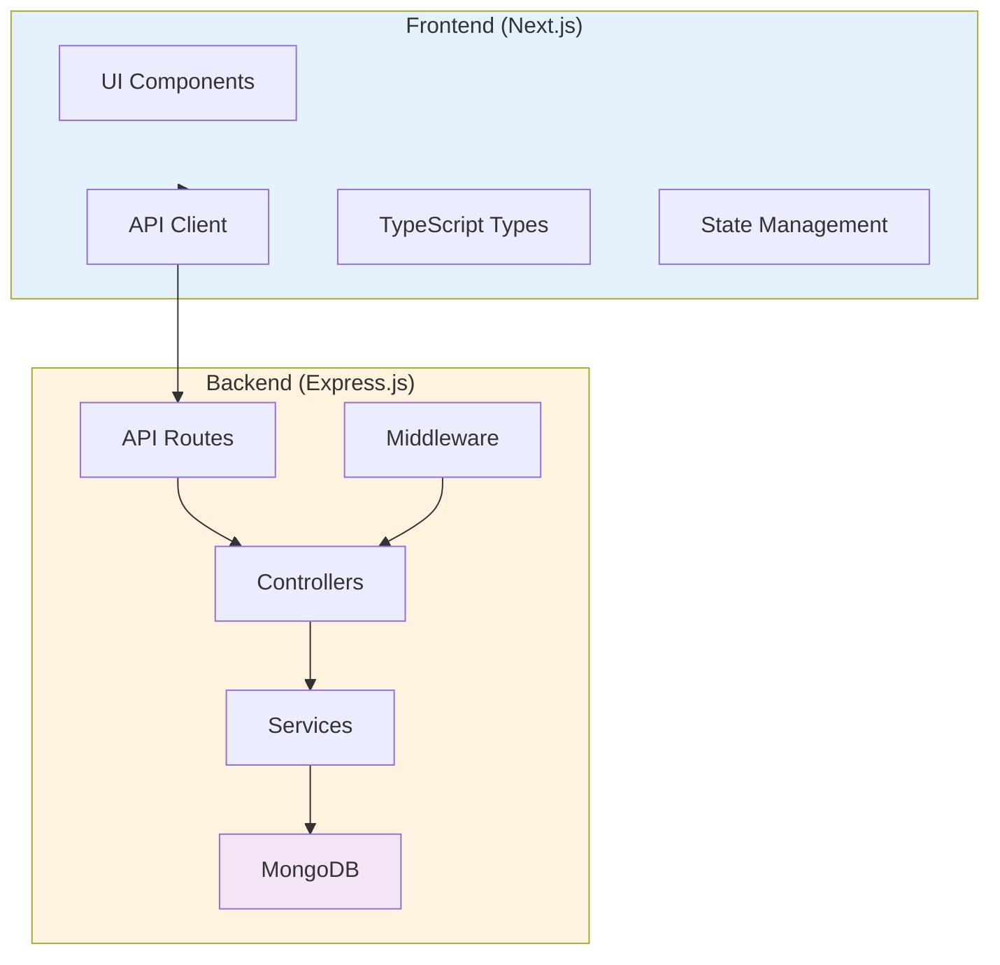
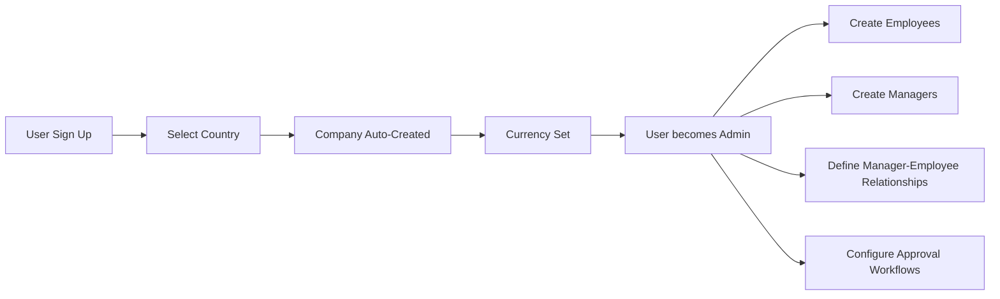
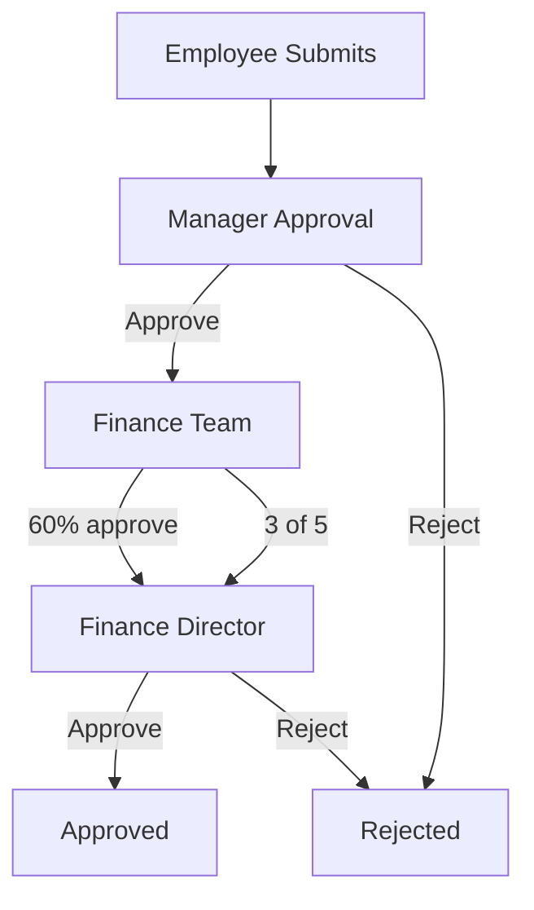

# Reimbursement Management System - Architecture Analysis

## Project Overview

A **full-stack role-based expense reimbursement system** with multi-tenant support, multi-step approval workflows, and OCR receipt processing.

---

## System Architecture



---

## Roles & Permissions

| Role | Permissions |
|------|-------------|
| **Admin** | Create company, manage users, configure approval workflows, view all expenses, override approvals |
| **Manager** | Approve/reject expenses, view team expenses, add comments, escalate |
| **Employee** | Submit expenses, view own history, check approval status, see comments |

---

## User Flow - Authentication & Company Setup



---

## Tech Stack

| Layer | Technology |
|-------|------------|
| **Frontend** | Next.js 16, React 19, TailwindCSS 4, TypeScript |
| **Backend** | Express.js 5, Node.js |
| **Database** | MongoDB with Mongoose ODM |
| **Authentication** | JWT (JSON Web Tokens) |
| **File Storage** | Multer (local) |
| **OCR** | Tesseract.js |
| **External APIs** | restcountries.com, exchangerate-api.com |

---

## Data Models

### 1. User Model
```javascript
{
  name, email, password, 
  role: Admin | Manager | Employee,
  companyId, managerId
}
```

### 2. Company Model
```javascript
{
  name, country, defaultCurrency
}
```

### 3. Expense Model
```javascript
{
  userId, companyId,
  amount, convertedAmount, currency, companyCurrency,
  category, description, merchantName, expenseDate,
  receiptImageUrl, status,
  approvalFlowId, currentStep,
  approvedBy, rejectedBy
}
```

### 4. ApprovalFlow Model
```javascript
{
  companyId, name, steps[], rules,
  isActive
}
```

### 5. ApprovalLog Model
```javascript
{
  expenseId, approverId, action, comment
}
```

---

## Approval Workflows

### A. Sequential Multi-Level Approval
```
Employee submits → Manager (Step 1) → Finance (Step 2) → Director (Step 3)
```
- Each approver must act before moving to next step
- Any rejection stops the flow

### B. Conditional Approval Rules

| Rule Type | Description |
|-----------|-------------|
| **Percentage** | If X% of approvers approve → Auto-approved |
| **Specific** | If designated approver (e.g., CFO) approves → Auto-approved |
| **Hybrid** | Percentage OR Specific - whichever is met first |

### C. Combined Workflow (Sequential + Conditional)



---

## Approval Flow Examples

### Example 1: Simple Sequential
```
John ($500) → Manager Sarah → Finance Mike → APPROVED ✓
```

### Example 2: Conditional (Percentage)
```
Jane ($2000) → 5 Dept Heads
  - 1: Approves
  - 2: Approves
  - 3: Approves (60% reached!)
→ AUTO-APPROVED ✓
```

### Example 3: Hybrid
```
Mike ($10,000) → Rule: 70% OR CFO approval
  - CFO: Approves immediately
→ AUTO-APPROVED ✓
```

---

## Multi-Currency Support

### External APIs Used
- **Country/Currency List**: `https://restcountries.com/v3.1/all`
- **Currency Conversion**: `https://api.exchangerate-api.com/v4/latest/{BASE}`

### Flow
```
Employee submits in USD → Convert to company currency (INR) → Manager sees INR
Original currency preserved for records
```

---

## OCR Feature

### What OCR Extracts
- Amount
- Date
- Description
- Expense type
- Merchant name
- Line items

### Benefits
- Reduces manual data entry errors
- Auto-fills expense form fields

---

## API Endpoints

```
/api/v1/
├── /health                    GET   - Health check
├── /auth                      POST  - Login, Register
├── /users                     CRUD  - User management
├── /expenses                  CRUD  - Expense operations
├── /approval-flows            CRUD  - Workflow configuration
├── /approvals
│   ├── /approve/:id            POST - Approve expense
│   ├── /reject/:id             POST - Reject expense
│   └── /pending                GET  - User's pending approvals
└── /ocr                       POST  - Receipt processing
```

---

## Security Features

1. **JWT Authentication** - Token-based with expiry
2. **Password Hashing** - bcrypt with salt
3. **Role-Based Authorization** - Admin, Manager, Employee
4. **Company Isolation** - Multi-tenant data separation
5. **Input Validation** - express-validator on all endpoints

---

## Project Structure

```
Reimbursement-management-odoo/
├── backend/
│   └── src/
│       ├── config/       # Environment & DB
│       ├── constants/    # Enums
│       ├── controllers/  # Route handlers
│       ├── middlewares/   # Auth, validation
│       ├── models/        # Mongoose schemas
│       ├── routes/        # API routes
│       ├── services/      # Business logic
│       ├── utils/         # Helpers
│       ├── validators/    # Request validation
│       └── seed/          # Database seeder
├── frontend/
│   └── src/
│       ├── app/          # Next.js pages
│       ├── components/   # React components
│       ├── hooks/        # Custom hooks
│       ├── lib/          # API client
│       ├── types/        # TypeScript types
│       └── utils/        # Helpers
└── README.md
```

---

## Dependencies

### Backend
- express, mongoose, jsonwebtoken, bcryptjs, multer, tesseract.js, helmet, cors, axios

### Frontend
- next, react, tailwindcss, zod, react-hook-form, zustand, axios, framer-motion, lucide-react